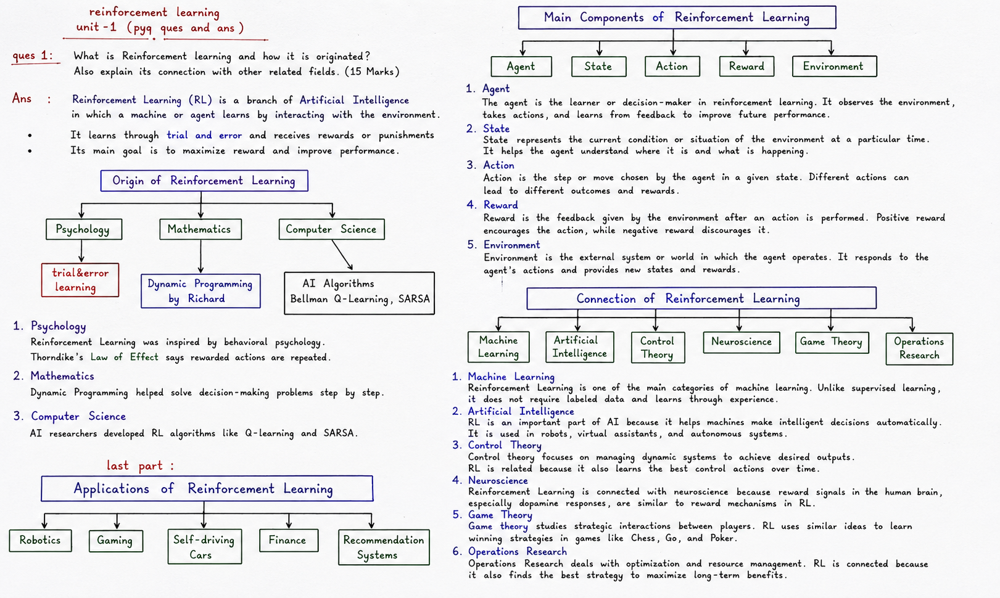

# NoteForge AI

Turn any raw lecture or exam text into clean, structured study notes — instantly.



## What it does

Paste raw text from lectures, PDFs, slides, or handwritten notes and NoteForge AI converts it into beautifully formatted study notes with numbered sections, formula boxes, comparison tables, flowcharts, and tree diagrams. Notes stream in real time as they are generated.

## Features

- **Instant conversion** — paste text, click Generate, notes appear in seconds
- **Rich formatting** — numbered sections, HR dividers, definition boxes, formula boxes, comparison tables, flowcharts, tree diagrams, and applications grids
- **Real-time streaming** — watch notes render as the model writes them
- **Persistent across refreshes** — input and generated notes are saved locally so nothing is lost on page reload
- **Export as PNG** — save notes as a standard or high-resolution image
- **Mobile friendly** — tab-based layout works on any screen size

## Tech stack

| Layer | Technology |
|-------|-----------|
| Framework | Next.js 14 (App Router) |
| Styling | Tailwind CSS v4 |
| AI Model | Llama 3.1 8B Instruct via NVIDIA NIM |
| Streaming | Server-Sent Events → ReadableStream |
| Runtime | Vercel Edge Functions |

## Getting started

**1. Clone the repo**

```bash
git clone https://github.com/shubh791/-noteforge-ai-.git
cd -noteforge-ai-
npm install
```

**2. Add your NVIDIA NIM API key**

Create a `.env.local` file in the project root:

```
NVIDIA_API_KEY=nvapi-your-key-here
```

Get a free key at [build.nvidia.com/settings/api-keys](https://build.nvidia.com/settings/api-keys)

**3. Run the dev server**

```bash
npm run dev
```

Open [http://localhost:3000](http://localhost:3000)

## Deploy on Vercel

1. Push this repo to GitHub
2. Import the project at [vercel.com](https://vercel.com)
3. Add `NVIDIA_API_KEY` in **Project Settings → Environment Variables**
4. Deploy

The `vercel.json` already sets `maxDuration: 60` for the API route so long generations do not time out.

## Project structure

```
app/
  page.jsx              — main layout and state
  api/generate/route.js — Edge API route (NIM streaming)
  globals.css           — Tailwind + notes-page styles
components/
  Topbar.jsx            — header with Generate / Clear / Export
  InputPanel.jsx        — API key input + raw text textarea
  PreviewPanel.jsx      — live notes preview
  Footer.jsx            — credits and links
lib/
  prompt.js             — system prompt for HTML note generation
```

## Environment variables

| Variable | Required | Description |
|----------|----------|-------------|
| `NVIDIA_API_KEY` | Yes (server) | NVIDIA NIM API key — can also be entered in the UI per session |

## Author

**Shubham Panghal**
- GitHub: [@shubh791](https://github.com/shubh791)
- LinkedIn: [shubham-panghal](https://www.linkedin.com/in/shubham-panghal/)
